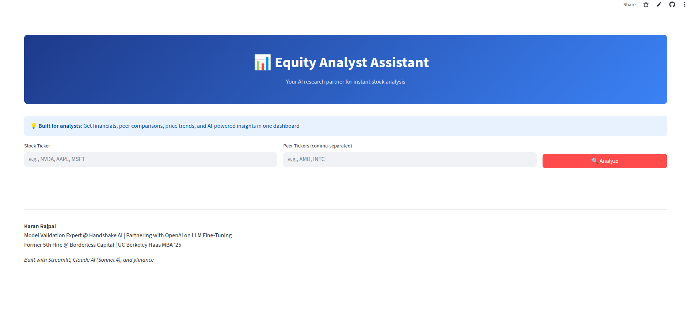

# Equity Analyst Assistant

**Institutional-grade equity research, powered by AI — delivered in under 3 minutes.**

Enter a ticker, get a full research brief: financials, peer comps, price momentum, news sentiment, and an AI-generated investment summary.



**[Try the Live Demo →](https://equity-research-ai-francium77.streamlit.app/)**

---

## What It Does

Traditional equity research takes analysts hours. This tool compresses the core workflow into a single interface: pull real-time financials, benchmark against peers, scan recent news for sentiment, and synthesize everything into a structured investment summary — all driven by Claude Sonnet 4.

## Architecture

```
User Input (Ticker) → yfinance (financials + price data)
                     → News API (recent headlines)
                     → Peer comparison engine
                     → Claude Sonnet 4 (synthesis + recommendation)
                     → Streamlit UI (interactive report)
```

**Stack:** Streamlit · yfinance · News API · Claude Sonnet 4 (Anthropic) · Streamlit Cloud

## Features

- Real-time financial metrics (P/E, margins, ROE, growth rates)
- Peer comparison with AI-driven relative analysis
- 30-day price trend and momentum indicators
- News sentiment scoring from recent headlines
- AI-generated investment summary with bull/bear thesis

## Quickstart

```bash
git clone https://github.com/AAP67/equity-research-ai.git
cd equity-research-ai
python -m venv venv && source venv/bin/activate
pip install -r requirements.txt
```

Create a `.env` file with your API keys:

```
ANTHROPIC_API_KEY=your_key
NEWS_API_KEY=your_key
```

Then run:

```bash
streamlit run app.py
```

Enter a ticker (e.g., `NVDA`), optionally add peers (`AMD, INTC`), and hit Analyze.

## Documentation

See [PROJECT_PLAN.md](PROJECT_PLAN.md) for complete technical documentation and development decisions.

## Built By

**[Karan Rajpal](https://www.linkedin.com/in/krajpal/)** — UC Berkeley Haas MBA '25 · LLM Validation @ Handshake AI (OpenAI/Perplexity) · Former 5th hire at Borderless Capital

Built in 16 hours to demonstrate how AI can compress institutional-grade workflows into accessible tools.
